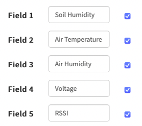
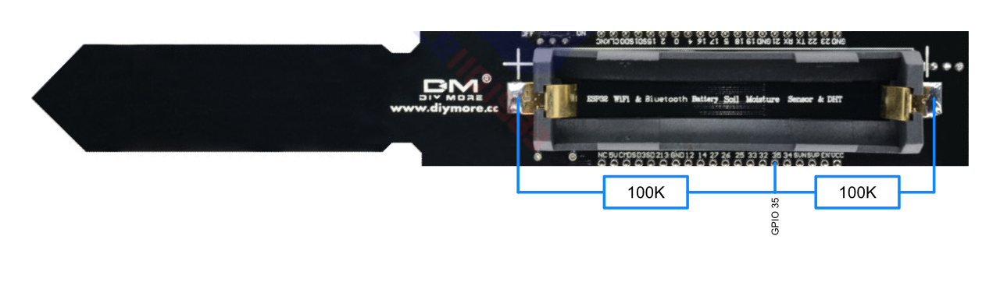
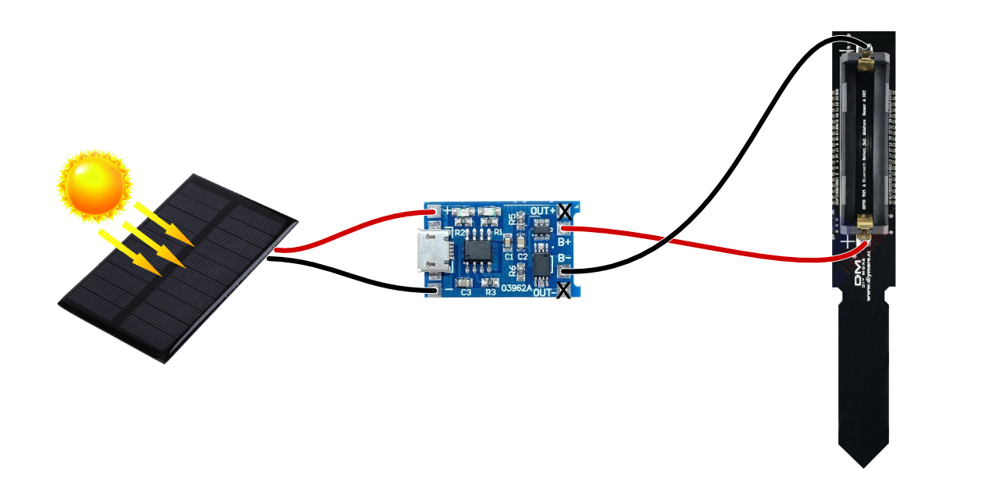

# PlantSpeak

PlantSpeak is an IoT project that publishes sensor data from an "ESP-32 Soil Moisture Sensor Module" to ThingSpeak. It collects data related to soil humidity, air temperature, air humidity, voltage, and RSSI, and sends it to ThingSpeak for further analysis and visualization.

The default upload period is one minute and if an error accoured, the esp32 will sleep for 5 minutes and then retry to upload (with new sensor data).

This project was inspired by:

- [DIY MORE ESP32 DHT11 Soil Sensor](https://templates.blakadder.com/diymore_012592.html)
- [ESP32 Soil Moisture Sensor](https://judelabs.com/esp32-soil-moisture-sensor)

## Installation

To install and set up PlantSpeak, please follow these steps:

### 1. Create a ThingSpeak Account

If you haven't already, create an account on [ThingSpeak](https://thingspeak.com) to host your sensor data.

This is my channel: [Thingspeak channel 1270350](https://thingspeak.com/channels/1270350)

### 2. Create a New Channel on ThingSpeak

Create a new channel on ThingSpeak with at least five fields. The default fields for PlantSpeak are as follows:


Also activate **Show Status**.

### 3. Clone the Repository

Clone the PlantSpeak repository to your local machine.

```bash
git clone https://github.com/SamKry/PlantSpeak.git
```

### 4. The secrets

#### 4.1 Create a `secrets.h` File

Create a file in the `src` directory with the file name `secrets.h`.

#### 4.2 Add credentials

Add this content to the `secrets.h` file:

```c++
// Use this file to store all of the private credentials 
// and connection details. Pay attention to not commit this file!

#define SECRET_SSID "Plant_Net_24"		    // replace MySSID with your WiFi network name
#define SECRET_PASS "onlyPlantsCanConnect24"	    // replace MyPassword with your WiFi password

#define SECRET_CH_ID 1270350L 		    // replace 0000000 with your channel number
#define SECRET_WRITE_API_KEY "IZ57RVWJ50DAH9KM" // replace MyAPIKey with your channel write API key
```

Modify the `secrets.h` file to include your network and ThingSpeak credentials. This file should not be committed to version control, as it contains sensitive information.

### 5. Hardware Setup

Follow the steps below to set up the hardware components for PlantSpeak.

#### 5.1 Solder the Voltage Sensor



Solder the two **100K Ohm** resistors to the ESP-32 board according to the provided diagram. The resistors are used to measure the voltage of the battery. Use `GPIO 35` for the voltage measurement.

If you don't want to measure the voltage, you can skip this step. However, you have to remove the corresponding code from the `main.cpp` file.

#### 5.2 (Optional) Add Solar Panel



If you want to power the system with a solar panel, solder the solar panel to the ESP-32 board following the provided diagram. A small battersie is sufficient to survive a day, but I recommend using a slightly larger LiPo, as it is not sunny every day in my region.
Two 5V 250mA solar panels are sufficient to power the system.
I use the following solar panels:
- [5V 1.2W 240mA DIY Polycrystalline Silicon Solar Panel Battery Solar Charger](https://www.aliexpress.com/item/1005005374229859.html?spm=a2g0o.order_list.order_list_main.135.28ce1802KfpHDL)
- [Solar Panel 5V Mini Solar System DIY For Battery Cell Phone Chargers Portable 0.7W 0.8W 1W 1.2W 2.5W 4.2W Solar Cell](https://www.aliexpress.com/item/32877113554.html?spm=a2g0o.order_list.order_list_main.131.28ce1802KfpHDL)

The battery can also be charged via the micro USB port.

### 6. Upload Code to the ESP-32

Use your preferred development environment (e.g., Visual Studio Code with the PlatformIO plugin or Arduino IDE) to upload the code to the ESP-32 board.

## Used Libraries

The following libraries are used in the PlantSpeak project:

- [mathworks/thingspeak-arduino @^2.0.0](https://github.com/mathworks/thingspeak-arduino)
- [adafruit/DHT sensor library@^1.4.4](https://github.com/adafruit/DHT-sensor-library)
- [adafruit/Adafruit Unified Sensor@^1.1.9](https://github.com/adafruit/Adafruit_Sensor)

Make sure to install these libraries before uploading the code to the ESP-32.

## Contributing

Contributions to PlantSpeak are welcome! If you have any ideas, improvements, or bug fixes, please open an issue or submit a pull request on this repository.

## License

[MIT License](https://opensource.org/licenses/MIT)
